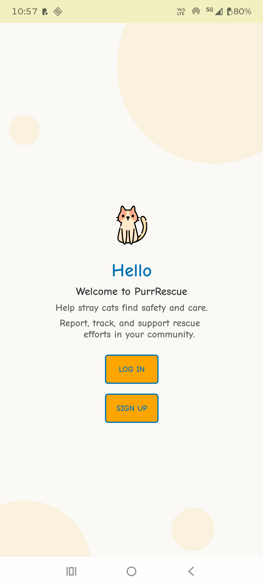
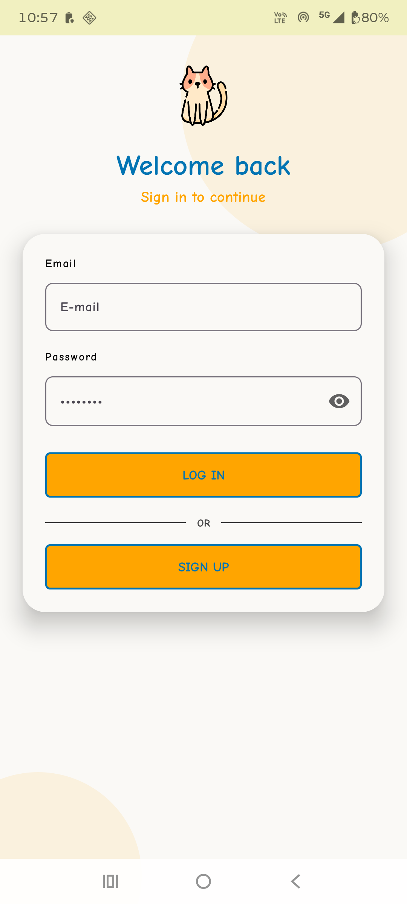
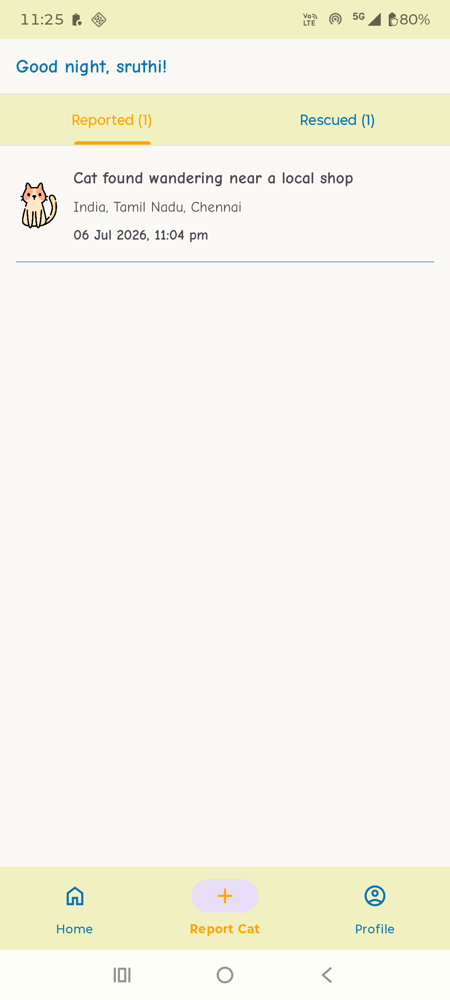
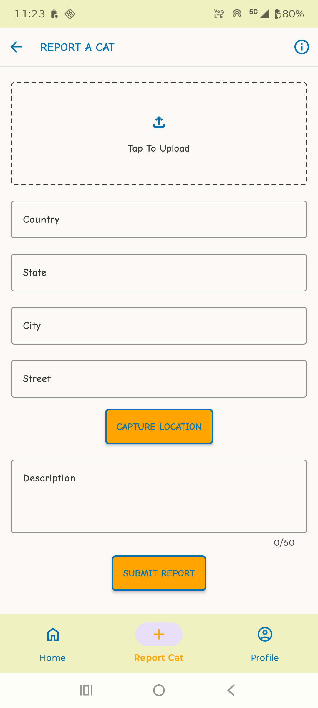
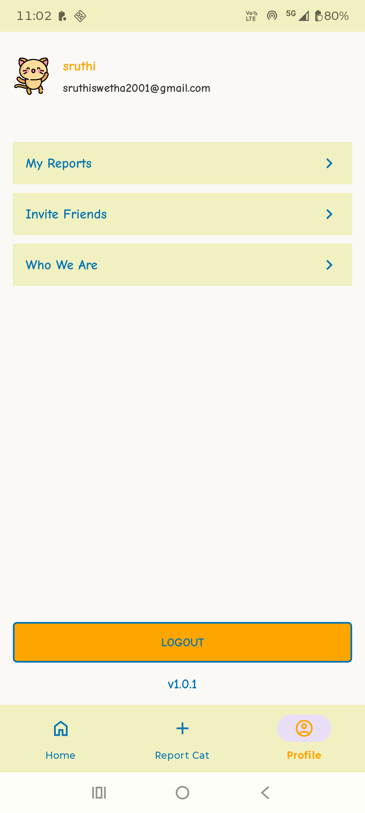

# PurrRescue

Community-driven app to report, track, and rescue stray cats.

## Screenshots

PurrRescue/
├── README.md
├── screenshots/
│   ├── welcome.png
│   ├── login.png
│   ├── home.png
│   ├── report_cat.png
│   └── profile.png

| Welcome                                    | Login                                   | Home                                 | Report a Cat                                       | Profile                                    |
|--------------------------------------------|-----------------------------------------|--------------------------------------|----------------------------------------------------|--------------------------------------------|
|  | > |  |  |  |


## Features

- **Authentication** — email/password sign up and login via Firebase Auth
- **Home Screen** — tabs for reported & rescued cats
- **Report a cat** — upload a photo, auto-capture GPS location with reverse-geocoded address (country/state/city/street), and add a description
- **Cat details** — view full details of a reported cat, including its location on a map
- **Mark as rescued** — confirm and update a cat's status, with a celebratory success screen
- **My Reports** — see all cats you've personally reported
- **Profile** — view account info, invite friends to the app, learn more in "Who We Are"
- **Share** — share a cat's details as an image, along with a link to the app
- **Logout** — securely signs out and clears session/back stack

## Tech stack

- **Language:** Kotlin
- **Architecture:** MVVM (ViewModel + LiveData), Repository pattern
- **Navigation:** Jetpack Navigation Component (single-Activity architecture)
- **Auth & backend:** Firebase Authentication, Cloud Firestore
- **Image hosting:** [ImgBB](https://api.imgbb.com/) (free REST API for photo uploads)
- **Maps & location:** Google Maps SDK, Fused Location Provider, Android `Geocoder`
- **UI:** ConstraintLayout, Material Components (`TextInputLayout`), View Binding
- **Tooltips:** [Balloon](https://github.com/skydoves/Balloon)
- **Async:** Kotlin Coroutines
- **Cat Images:** Flat Icons

## Getting started

### Prerequisites
- Android Studio (latest stable)
- A Firebase project with **Authentication** (Email/Password) and **Firestore** enabled
- An [ImgBB](https://api.imgbb.com/) API key (free) for photo uploads
- A Google Maps API key with the **Maps SDK for Android** enabled

### Setup
1. Clone the repo:
   ```
   git clone https://github.com/<your-username>/purrrescue.git
   ```
2. Add your Firebase config file to the app module:
   ```
   app/google-services.json
   ```
3. Add your API keys to `local.properties`:
   ```
   MAPS_API_KEY=your_key_here
   IMGBB_API_KEY=your_key_here
   ```
4. Build and run on a device or emulator with Google Play services.

## Permissions

| Permission | Why it's needed |
|---|---|
| `ACCESS_FINE_LOCATION` / `ACCESS_COARSE_LOCATION` | Capture the reported cat's location |
| Photo/media access | Upload a photo of the reported cat |
| `INTERNET` | Firebase Auth, Firestore, ImgBB, and Maps API calls |

## Project structure

```
ui/
 ├─ welcome/     # Welcome/landing screen
 ├─ login/       # Login screen + ViewModel
 ├─ signup/      # Signup screen + ViewModel
 ├─ home/        # Cat feed (reported & rescued tabs)
 ├─ details/     # Individual cat details, map, mark-as-rescued flow
 ├─ reports/     # Report-a-cat form (photo, location, description)
 ├─ myreports/   # User's own reported cats
 ├─ profile/     # Account, invite, about
 └─ aboutUs/     # Who We Are
data/
 ├─ model/       # Cat
 └─ repository/  # AuthRepository, CatRepository
utils/
 └─ Utils        # Shared helpers (toast, share, connectivity, date formatting)
```

## Known limitations

- **Push notifications** are not currently implemented. The intended design was a Firestore-triggered Cloud Function sending FCM notifications to all users on a new report, but this requires the Blaze billing plan, which was blocked by a pending billing account verification during development. Planned as a future enhancement.
- **Image hosting via ImgBB** is used as a substitute for Firebase Cloud Storage for the same billing-related reason above. A production version would likely move to Firebase Storage or another managed solution.


## Contributing

Issues and pull requests are welcome. Please open an issue first to discuss what you'd like to change.


## Acknowledgments
Got help from [Claude](https://claude.ai), for the below:

- Debugging Firebase integration issues
- On using IMGBB api for image uploading
- README FILE creation
- creating bitmap for image sharing
- Code review and bug fixes
- All product ideas, features, and design decisions are my own.

## License

_Add your license here (e.g. MIT)._
